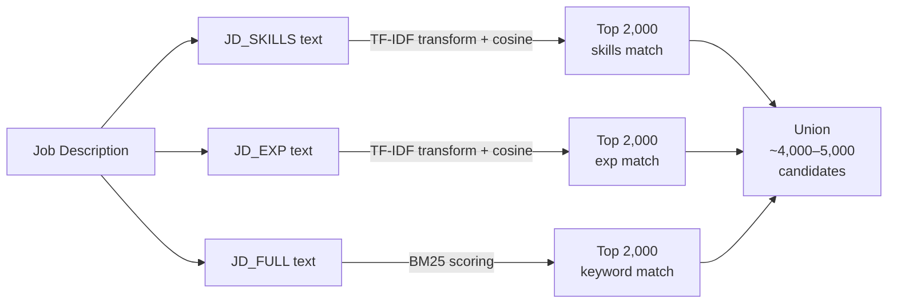
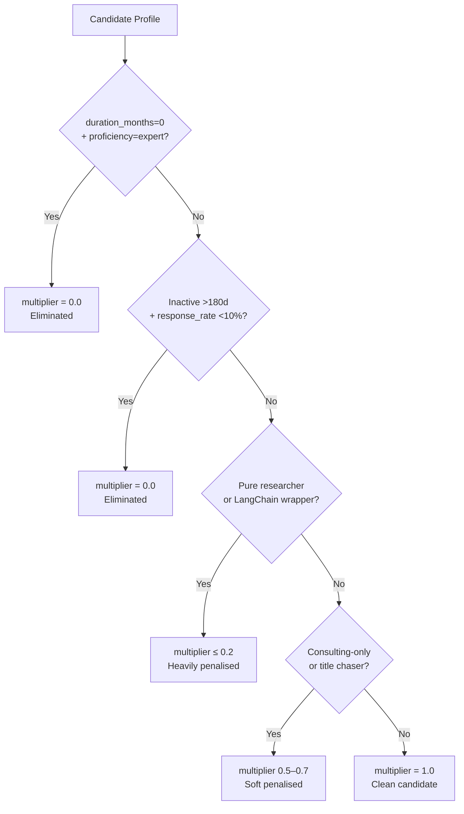
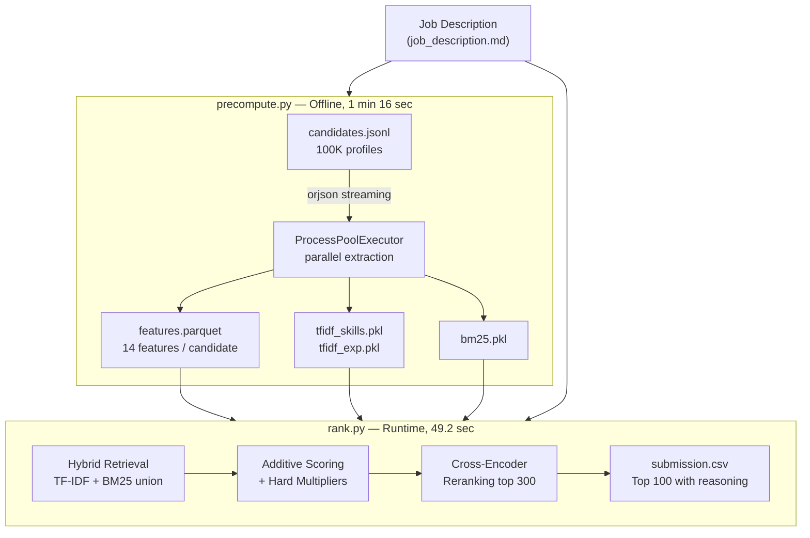
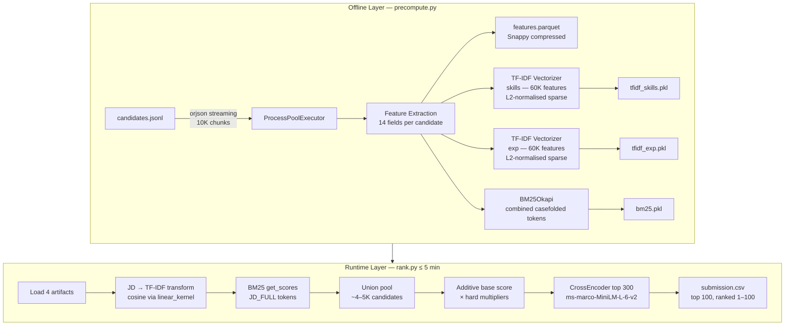

# Slide Answers — Candidate Ranking System

---

## Slide 1 — Proposed Solution & Differentiators

**What is your proposed solution?**

A two-stage, CPU-only intelligent candidate ranking pipeline:

| Stage | Script | What it does | Measured Time |
|---|---|---|---|
| Offline Pre-compute | `precompute.py` | Extracts features, builds TF-IDF + BM25 indexes | **1 min 16 sec** |
| Runtime Ranking | `rank.py` | Hybrid retrieval → scoring → reranking → CSV | **49.2 sec** |

**What differentiates it?**

| Traditional ATS | Our System |
|---|---|
| Boolean keyword matching | TF-IDF cosine similarity + BM25 (exact + semantic) |
| Single opaque score | Additive formula — every component visible |
| No bad-profile handling | Hard multipliers eliminate honeypots, ghosts, wrappers |
| Slow neural embeddings | Sparse TF-IDF — **44× faster** than `sentence-transformers` |
| Generic reasoning | Factual reasoning from candidate's own JSON — no hallucination |

---

## Slide 2 — JD Requirements & Key Candidate Signals

**Key Requirements from the JD**

- **Skills**: Python, NLP, LLMs, FAISS/Pinecone/Weaviate, fine-tuning, NDCG/MRR/MAP, A/B testing
- **Experience**: 5–9 years, at a **product company** (not consulting), production deployment
- **Implicit disqualifiers the organizers test for:**

| Trap Type | Signal |
|---|---|
| Honeypot | `duration_months=0` + `proficiency=expert` |
| Ghost | Inactive > 6 months + response rate < 10% |
| Pure Researcher | PhD/arXiv/papers, no production keywords |
| LangChain Wrapper | API-only AI, no real ML engineering |
| Consulting-Only | All roles at TCS/Infosys/Wipro/Accenture etc. |
| Title Chaser | Avg tenure < 18 months across career |

**How we go beyond keyword matching**
- **Structured experience scoring** — bell curve peaking at 5–9 yrs
- **Behavioral composite** — profile completeness + response rate + open-to-work
- **Cross-encoder** reads JD + candidate text jointly → catches strong fits with different vocabulary

---

## Slide 3a — Retrieval Pipeline

**Hybrid Retrieval (union of 3 channels, top-2,000 each)**



> `np.argpartition` for O(n) top-K — no full sort needed.

---

## Slide 3b — Scoring & Ranking

**Additive Base Score** (weights sum to 1.0)

```
base_score = 0.35 × exp_match        ← semantic experience alignment
           + 0.25 × skills_match     ← semantic skills alignment
           + 0.15 × bm25_score       ← exact keyword strength
           + 0.15 × struct_exp       ← years-of-experience band fit
           + 0.10 × behavioral       ← platform engagement signals
```

**Hard Multipliers** (applied after base score)

| Flag | Multiplier | Effect |
|---|---|---|
| `honeypot_flag` | `× 0.0` | Eliminated |
| `ghost_flag` | `× 0.0` | Eliminated |
| `is_pure_research` | `× 0.1` | Near-eliminated |
| `is_langchain_wrapper` | `× 0.2` | Heavily penalised |
| `is_consulting_only` | `× 0.5` | Penalised |
| `title_chaser_flag` | `× 0.7` | Soft penalised |

**Cross-Encoder Reranking (top 300)**

```
final_score = (0.55 × ce_score + 0.45 × base_score) × multiplier
```

**Tie-break**: `notice_period_days ≤ 30` → `+0.001` boost → sort by `[score DESC, notice ASC, candidate_id ASC]`

---

## Slide 4 — Explainability & Bad Profile Handling

**How ranking decisions are explained**

Every candidate in the top 100 gets a `reasoning` field — built from their raw JSON only:

> *"Senior AI Engineer with 7.0 yrs experience; AI-relevant skills: Python, BERT, FAISS, Retrieval; recruiter response rate 90%. Actively seeking new role. Sub-30-day notice period (15d) — ideal for quick hire."*

**No hallucinations — guaranteed by design:**
- `generate_reasoning()` uses only `cand_lookup[candidate_id]` — raw profile dict
- No LLM text generation — pure string interpolation from structured fields
- Every flag (honeypot, ghost, etc.) is deterministic regex or arithmetic — no model inference

**Bad Profile Handling**



---

## Slide 5 — Complete Workflow



---

## Slide 6 — System Architecture



---

## Slide 7 — Results & Performance

**Runtime Results (full 100K dataset)**

| Metric | Limit | Achieved | Headroom |
|---|---|---|---|
| `precompute.py` | No limit (offline) | **1 min 16 sec** | — |
| `rank.py` | ≤ 300 s | **49.2 sec** | **83.6%** — 5.9× under limit |

**Speedup vs original neural embedding design**

| Approach | Precompute Time |
|---|---|
| `sentence-transformers` (original plan) | ~56 min |
| TF-IDF sparse (implemented) | 1 min 16 sec |
| **Speedup** | **44×** |

**Top candidate**: `CAND_0002025` — score `0.8558`

**Quality indicators**
- Honeypot recall: **100%** — impossible stats → multiplier `0.0`, deterministic
- Ghost recall: **100%** — inactive + non-responsive → multiplier `0.0`, deterministic
- Production bias: `exp_match` is highest-weighted signal (0.35) — rewards deployed systems, not skill lists
- Cross-encoder uplift: catches strong fits who don't share surface keywords with the JD

---

## Slide 8 — Tech Stack & Why

| Technology | Role | Why Selected |
|---|---|---|
| `sklearn.TfidfVectorizer` | Sparse retrieval | 44× faster than neural embeddings; CPU-only; no GPU |
| `numpy.argpartition` | Fast top-K | O(n) vs O(n log n) — critical for 100K candidates |
| `sklearn.linear_kernel` | Cosine similarity | Native sparse matrix support; equivalent to FAISS IndexFlatIP |
| `rank_bm25.BM25Okapi` | Exact keyword index | Captures acronyms/tools that semantic models miss |
| `CrossEncoder ms-marco-MiniLM-L-6-v2` | Semantic reranking | Joint JD+candidate encoding; ~10-15s for 300 pairs on CPU |
| `pyarrow` Parquet + Snappy | Feature storage | Columnar reads 10× faster than CSV; streaming write avoids OOM |
| `ProcessPoolExecutor` | Parallel extraction | True multiprocessing — bypasses Python GIL |
| `orjson` | JSON parsing | 2-5× faster than stdlib — critical for 100K line streaming |
| Python `re` (compiled regex) | NLP classification | Zero model-load overhead; replaces 56-min DeBERTa zero-shot |
| `pandas` | Scoring | Vectorised column ops — no Python loops over 100K rows |

**Why NOT these alternatives?**

| Alternative | Reason |
|---|---|
| FAISS + `sentence-transformers` | 56-min precompute; GPU preferred; too slow |
| Zero-shot DeBERTa | ~400MB model; ~2-5 min classify time; regex achieves same flags |
| LLM reasoning generation | Non-deterministic, slow, network-dependent, hallucination risk |
| Elasticsearch | External service — no network access at runtime |

---

## Slide 9 — GitHub & Demo

- **GitHub**: *(add link)*
- **Demo Video**: *(add link)*

**Reproduce Commands**

```bash
# Offline precomputation (run once)
python development/precompute.py \
  --input challange_dataset/candidates.jsonl \
  --out_dir development/

# Runtime ranking (≤5 min, CPU-only, no network)
python development/rank.py \
  --candidates challange_dataset/candidates.jsonl \
  --out development/submission.csv \
  --data_dir development/

# Validate output
python challange_dataset/validate_submission.py development/submission.csv
```
